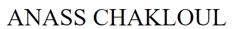
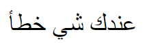
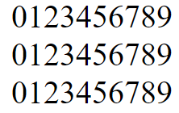
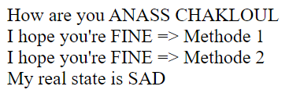

# 3  - echo and variable
```php

<?php
//طريقة حجز متغير
$name = "ANASS";

// طريقة الطباعة
echo $name . " " . "CHAKLOUL";

?>
```
## Output :


# 4 -  if else
```php
<?php
// طريقة و ضع الشرط
$price = 899;

if ($price > 1000) {
  echo "price > 1000";
} elseif ($price >= 900 && $price < 1000) {
  echo "price < 1000";
} else {
  echo "عندك شي خطأ";
}
?>
```
## Output :


# 5  - PHP Loops

```php
<?php

$i0 = 0;
$i1 = 0;

//while طالما
while ($i0 < 10) {

  echo  $i0;
  $i0++;
}

echo  "<br>";

// do while نفذ الكود أول ثم تحقق من الشرط عند الإنتهاء

do {
  echo $i1;
  $i1++;
} while ($i1 < 10);

echo  "<br>";
//for لأجل
//يمكنك تعريف المتغير بداخل ال for

for($i2 = 0; $i2 < 10; $i2++){
  echo $i2;
}
?>
```
## Output:


# 6  -  Function
```php
<?php
//Function دالة

$state = " FINE ";
function printname($name)
{
  echo "How are you" . $name;
  echo "<br>";
  echo "I hope you're" . $GLOBALS['state'] . "=> Methode 1";
  echo "<br>";
  global $state;
  echo "I hope you're" . $state  . "=> Methode 2";
  //في حال أردت إستدعاء متغير يوجد داخل الدالةPrivet variable من الخارج
  //قم بالتصريح بأنه Global من داخل الدال بالشكل التالي:
  $GLOBALS['statePrivet'] = " SAD ";
  echo "<br>";
}
//لكي أطبع الدالة أكتب إسمها فقط
printname(" ANASS CHAKLOUL"); // إياك أن تنسى إستدعاء الدالة

//في لغة دارت يمكنك أن تستدعي المتغير الذي يوجد خارج الدالة 
// من دون مشاكل لأنه Global 
// أما في لغة PHP ضرور تصرح بأنه Global لكي تستدعيه كما
// هو موضح في المثال التالي :

$GLOBALS['state'];
// أو بهذا الشكل
global $state;

echo "My real state is " . $statePrivet;


?>
```
## Output :
